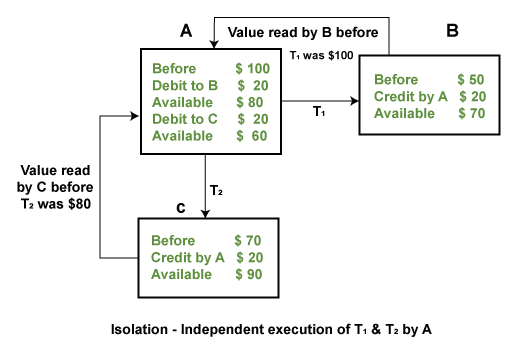

<h1 style=color:blue;>POSTGRESQL ASSIGNMENT :2</h1>

## Q1. What is RDBMS? Explain in your words with examples?

 A relational database is a collection of information that organizes data in predefined relationships where data is stored in one or more tables (or "relations") of columns and rows, making it easy to see and understand how different data structures relate to each other. Relationships are a logical connection between different tables, established on the basis of interaction among these tables. 

Developed by E.F. Codd from IBM in the 1970s, the relational database model allows any table to be related to another table using a common attribute. Instead of using hierarchical structures to organize data, Codd proposed a shift to using a data model where data is stored, accessed, and related in tables without reorganizing the tables that contain them. 

## Examples of relational databases:

Some of the most well-known RDBMSs include MySQL, PostgreSQL, MariaDB, Microsoft SQL Server, and Oracle Database.

<h2>Relational Database:</h2>

The Customer table contains data about the customer: 

    Customer ID (primary key)
    Customer name
    Billing address
    Shipping address 

In the Customer table, the customer ID is a primary key that uniquely identifies who the customer is in the relational database. No other customer would have the same Customer ID. 

The Order table contains transactional information about an order: 

    Order ID (primary key)
    Customer ID (foreign key)
    Order date 
    Shipping date
    Order status

Here, the primary key to identify a specific order is the Order ID. You can connect a customer with an order by using a foreign key to link the customer ID from the Customer table. 

The two tables are now related based on the shared customer ID, which means you can query both tables to create formal reports or use the data for other applications. For instance, a retail branch manager could generate a report about all customers who made a purchase on a specific date or figure out which customers had orders that had a delayed delivery date in the last month. 

The above explanation is meant to be simple. But relational databases also excel at showing very complex relationships between data, allowing you to reference data in more tables as long as the data conforms to the predefined relational schema of your database. 

As the data is organized as pre-defined relationships, you can query the data declaratively. A declarative query is a way to define what you want to extract from the system without expressing how the system should compute the result. This is at the heart of a relational system as opposed to other systems.

## Q2. What is ACID, Explain with example?

To maintain the integrity of the data, there are four properties described in the database management system, which are known as the ACID properties. The ACID properties are meant for the transaction that goes through a different group of tasks, and there we come to see the role of the ACID properties.

## ACID Properties

### The expansion of the term ACID defines for:

### 1) Atomicity:

The term atomicity defines that the data remains atomic. It means if any operation is performed on the data, either it should be performed or executed completely or should not be executed at all. It further means that the operation should not break in between or execute partially. In the case of executing operations on the transaction, the operation should be completely executed and not partially.

### Example:

If Remo has account A having $30 in his account from which he wishes to send $10 to Sheero's account, which is B. In account B, a sum of $ 100 is already present. When $10 will be transferred to account B, the sum will become $110. Now, there will be two operations that will take place. One is the amount of $10 that Remo wants to transfer will be debited from his account A, and the same amount will get credited to account B, i.e., into Sheero's account. Now, what happens - the first operation of debit executes successfully, but the credit operation, however, fails. Thus, in Remo's account A, the value becomes $20, and to that of Sheero's account, it remains $100 as it was previously present.

In the above diagram, it can be seen that after crediting $10, the amount is still $100 in account B. So, it is not an atomic transaction.

The below image shows that both debit and credit operations are done successfully. Thus the transaction is atomic.

Thus, when the amount loses atomicity, then in the bank systems, this becomes a huge issue, and so the atomicity is the main focus in the bank systems.

### 2) Consistency:

The word consistency means that the value should remain preserved always. In DBMS, the integrity of the data should be maintained, which means if a change in the database is made, it should remain preserved always. In the case of transactions, the integrity of the data is very essential so that the database remains consistent before and after the transaction. The data should always be correct.

### Example:

In the above figure, there are three accounts, A, B, and C, where A is making a transaction T one by one to both B & C. There are two operations that take place, i.e., Debit and Credit. Account A firstly debits $50 to account B, and the amount in account A is read $300 by B before the transaction. After the successful transaction T, the available amount in B becomes $150. Now, A debits $20 to account C, and that time, the value read by C is $250 (that is correct as a debit of $50 has been successfully done to B). The debit and credit operation from account A to C has been done successfully. We can see that the transaction is done successfully, and the value is also read correctly. Thus, the data is consistent. In case the value read by B and C is $300, which means that data is inconsistent because when the debit operation executes, it will not be consistent.

### 3) Isolation:

The term 'isolation' means separation. In DBMS, Isolation is the property of a database where no data should affect the other one and may occur concurrently. In short, the operation on one database should begin when the operation on the first database gets complete. It means if two operations are being performed on two different databases, they may not affect the value of one another. In the case of transactions, when two or more transactions occur simultaneously, the consistency should remain maintained. Any changes that occur in any particular transaction will not be seen by other transactions until the change is not committed in the memory.

### Example:

If two operations are concurrently running on two different accounts, then the value of both accounts should not get affected. The value should remain persistent. As you can see in the below diagram, account A is making T1 and T2 transactions to account B and C, but both are executing independently without affecting each other. It is known as Isolation.

### 4) Durability:

Durability ensures the permanency of something. In DBMS, the term durability ensures that the data after the successful execution of the operation becomes permanent in the database. The durability of the data should be so perfect that even if the system fails or leads to a crash, the database still survives. However, if gets lost, it becomes the responsibility of the recovery manager for ensuring the durability of the database. For committing the values, the COMMIT command must be used every time we make changes.

Therefore, the ACID property of DBMS plays a vital role in maintaining the consistency and availability of data in the database.

Thus, it was a precise introduction of ACID properties in DBMS. We have discussed these properties in the transaction section also.

## Q3. Explain RDBMS vs DBMS?

##### Relational Database Management System is an advanced version of a DBMS.

<table>

<tr style="background-color: yellow;">
<th style="border: 2px solid green; text-align: center;">DBMS </th>
<th style="border: 2px solid green; text-align: center;">RDBMS</th>

</tr>

<tr style="background-color: lightgray;"><td style="border: 1px solid green;">DBMS stores data as file.</td> <td style="border: 1px solid green;">RDBMS stores data in tabular form.</td> </tr>
<tr style="background-color: lightgray;"><td style="border: 1px solid green;">Data elements need to access individually.</td> <td style="border: 1px solid green;">Multiple data elements can be accessed at the same time.</td> </tr>
<tr style="background-color: lightgray;"><td style="border: 1px solid green;">No relationship between data.</td> <td style="border: 1px solid green;">Data is stored in the form of tables which are related to each other.</td> </tr>
<tr style="background-color: lightgray;"><td style="border: 1px solid green;">Normalization is not present.</td> <td style="border: 1px solid green;">Normalization is present.</td style="border: 1px solid green;"> </tr>
<tr style="background-color: lightgray;"><td style="border: 1px solid green;">DBMS does not support distributed database.</td> <td style="border: 1px solid green;">RDBMS supports distributed database.</td> </tr>
<tr style="background-color: lightgray;"><td style="border: 1px solid green;">It stores data in either a navigational or hierarchical form.</td> <td style="border: 1px solid green;">It uses a tabular structure where the headers are the column names, and the rows contain corresponding values.</td> </tr>
<tr style="background-color: lightgray;"><td style="border: 1px solid green;">It deals with small quantity of data.</td> <td style="border: 1px solid green;">It deals with large amount of data.</td> </tr>
<tr style="background-color: lightgray;"><td style="border: 1px solid green;">Data redundancy is common in this model.</td> <td style="border: 1px solid green;">Keys and indexes do not allow Data redundancy.</td> </tr>
<tr style="background-color: lightgray;"><td style="border: 1px solid green;">It is used for small organization and deal with small data.</td> <td style="border: 1px solid green;">It is used to handle large amount of data.</td> </tr>
<tr style="background-color: lightgray;"><td style="border: 1px solid green;">Not all Codd rules are satisfied.</td> <td style="border: 1px solid green;">All 12 Codd rules are satisfied.</td> </tr>
<tr style="background-color: lightgray;"><td style="border: 1px solid green;">Security is less</td> <td style="border: 1px solid green;">More security measures provided.</td> </tr>
<tr style="background-color: lightgray;"><td style="border: 1px solid green;">It supports single user.</td> <td style="border: 1px solid green;">It supports multiple users.</td> </tr>
<tr style="background-color: lightgray;"><td style="border: 1px solid green;">Data fetching is slower for the large amount of data.</td> <td style="border: 1px solid green;">Data fetching is fast because of relational approach.</td> </tr>
<tr style="background-color: lightgray;"><td style="border: 1px solid green;">The data in a DBMS is subject to low security levels with regards to data manipulation.</td> <td style="border: 1px solid green;">There exists multiple levels of data security in a RDBMS.</td> </tr>
<tr style="background-color: lightgray;"><td style="border: 1px solid green;">Low software and hardware necessities.</td> <td style="border: 1px solid green;">Higher software and hardware necessities.</td> </tr>
<tr style="background-color: lightgray;"><td style="border: 1px solid green;">Examples: XML, Window Registry, Forxpro, dbaseIIIplus etc.</td> <td style="border: 1px solid green;">Examples: MySQL, PostgreSQL, SQL Server, Oracle, Microsoft Access etc.</td> </tr>

</table>

## 4. What are primary and foreign keys?

### Primary Key:

A primary key generally focuses on the uniqueness of the table. It is a column or a set of columns that uniquely distinguishes every row in the database. It means it should not have any duplicate value. Also, it doesn’t contain a NULL value.

### Foregin Key:

A foreign key is generally used to build a relationship between the two tables. The major purpose of the foreign key is to sustain data integrity between two separate instances of an entity.

#### Difference Between Primary Key and Foreign Key:

<table style="border: 2px solid green;">

<tr style="background-color: yellow;" >
<th>S.NO</th>
<th>Primary Key</th>
<th>Foreign Key</th>
</tr>

<tr style="background-color: lightgray;"><td style="border: 1px solid green;">1</td><td style="border: 1px solid green;">A primary key generally focuses on the uniqueness of the table. It assures the value in the specific column is unique.</td style="border: 1px solid green;"><td style="border: 1px solid green;">A foreign key is generally used to build a relationship between the two tables.</td></tr>
<tr style="background-color: lightgray;"><td style="border: 1px solid green;">2</td><td style="border: 1px solid green;"> 	The table allows only one primary key.</td><td style="border: 1px solid green;"> 	Tables can allow more than one foreign key.</td></tr>
<tr style="background-color: lightgray;"><td style="border: 1px solid green;">3</td><td style="border: 1px solid green;">The primary key doesn’t allow null values.</td><td style="border: 1px solid green;">The foreign key accepts multiple null values.</td></tr>
<tr style="background-color: lightgray;"><td style="border: 1px solid green;">4</td><td style="border: 1px solid green;"> 	It can identify the record uniquely in the database table.</td><td style="border: 1px solid green;">A foreign key is a field in the table that is the primary key in another table.</td></tr>
<tr style="background-color: lightgray;"><td style="border: 1px solid green;">5</td><td style="border: 1px solid green;">In the primary key, the value cannot be removed from the parent table.</td><td style="border: 1px solid green;">In this, the value can be deleted from the child table.</td></tr>
<tr style="background-color: lightgray;"><td style="border: 1px solid green;">6</td><td style="border: 1px solid green;">Its restriction can be completely defined on the temporary tables.</td><td >Its restriction cannot be defined on the global or local temporary tables.</td></tr>

</table>

## 5. What is Indexing, Common indexing types. Explain with Example.

A Data Structure technique that helps in the retrieval of records from a database file quickly is known as Indexing. When a query is processed, Indexing is used to optimize the performance of the database by minimizing the number of disk accesses required.

Indexing is used to locate and access the data in the database quickly.

### Indexing Methods in DBMS:

#####  There are 4 types of indexing in DBMS:-

1. Primary Index
2. Dense Index
3. Sparse Index
4. Cluster Index

### 1. Primary Index:

    Primary indexing refers to the process of creating an index based on the table’s primary key. These primary keys are specific to each record and establish a 1:1 relationship between them.
    The searching operation is fairly efficient because primary keys are stored in sorted order.
    There are two types of primary indexes: dense indexes and sparse indexes.

### 2. Dense Index:

Every search key value in the data file has an index record in the dense index. It speeds up the search process. The total number of records present in the index table and the main table are the same in this case. It requires extra space to hold the index record. A pointer to the actual record on the disk and the search key are both included in the index records.

### 3.  Sparse Index:

Only a few items in the data file have index records. Each and every item points to a certain block. Rather than pointing to each item in the main database, the index, in this case, points to the records that are present in the main table that is in a gap.

### 4. Clustering Index:

Records, not pointers, are stored in this sort of indexing. An organized data file is another way to describe it. The index is occasionally built on non-primary key columns, which might not be distinct for every record. To obtain the unique values in a case like this, you can group two or more columns and build a type of index called a clustered index. This makes it easier for you to find the record quickly. Records with comparable qualities are grouped, and for these categories only, indexes are made.

For example, students studying in each semester are grouped together, that is, first-semester, second-semester, third-semester, etc.

